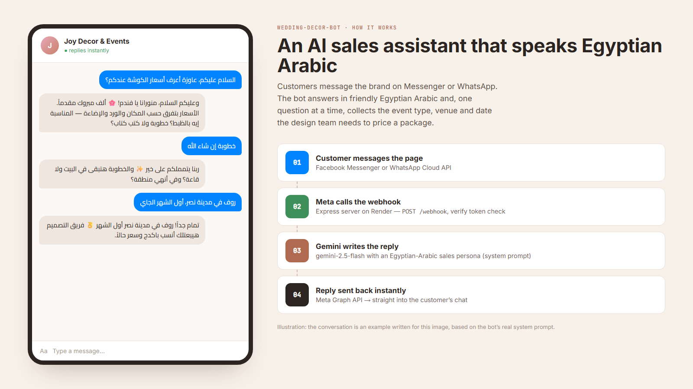

<div align="center">

# Wedding & Event Decor AI Bot

**An AI sales assistant for Facebook Messenger and WhatsApp that replies in every customer's language**




<sub>Illustration: the conversation is an example written for this image, based on the bot's real system prompt.</sub>

</div>

A webhook server that connects decor brands' Facebook pages and WhatsApp numbers to Google Gemini. Customers get instant replies in their own language and dialect (Egyptian Arabic by default), and the bot collects the **event type, venue and date**, one question at a time, so the design team can price the right package.

**Features:** conversation memory · replies in any language · understands photos and voice notes · sends catalog photos with quick-reply buttons · lead capture to Google Sheets with Telegram alerts · human handoff · **multi-business dashboard** (Arabic / English) to manage conversations, leads, settings and catalogs.

---

# 🌸 بوت ديكورات المناسبات بالذكاء الاصطناعي (Wedding & Event Decor AI Bot)

مشروع متكامل لسيرفر **Express.js (Node.js)** يعمل كـ **Webhook** للربط المباشر بين منصات التواصل الاجتماعي (**Facebook Messenger** و **WhatsApp Cloud API**) مع **Google Gemini API** مجاناً.

البوت معمول لـ **محلات وبراندات ديكورات الأفراح والمناسبات في أي مكان في العالم**: بيرد على العملاء بلغتهم ولهجتهم، ويجمع تفاصيل المناسبة، ويبعت صور الشغل، ويفهم الصور والفويس، ويبلغ صاحب المحل بالطلبات.

**سيرفر واحد يخدم أي عدد من البيزنسات**، وكل بيزنس ليه إعداداته وكتالوجه وصفحته ورقمه، وبيتحكم في كل ده من **لوحة تحكم** (`/dashboard`) بالعربي والإنجليزي من غير ما يلمس الكود.

---

## 🛠️ التكنولوجيات المستخدمة
- **Node.js (ES Modules)**
- **Express.js** (إطار عمل السيرفر والـ Webhook)
- **@google/genai** (المكتبة الرسمية الأحدث للتعامل مع Google Gemini API)
- **Axios** (لاستهداف Meta Graph API وإرسال الردود للعملاء)
- **dotenv** (لإدارة متغيرات البيئة)

---

## 📁 هيكل المشروع

```text
wedding-decor-bot/
├── index.js           # السيرفر، التحقق من توقيع Meta، وتوجيه الرسائل
├── src/
│   ├── businesses.js  # البيزنسات: إعدادات كل بيزنس، وتوجيه الرسايل للبيزنس الصح
│   ├── prompt.js      # قالب الـ System Prompt (بيتبني من إعدادات كل بيزنس)
│   ├── gemini.js      # الاتصال بـ Google Gemini (الرد + استخراج بيانات الطلب)
│   ├── i18n.js        # نصوص لوحة التحكم والإشعارات (عربي / إنجليزي)
│   ├── dashboard/     # لوحة التحكم: الدخول، الصفحات، والروابط
│   ├── meta.js        # إرسال واستقبال (نص، صور، فويس، كروت، أزرار) على Messenger و WhatsApp
│   ├── incoming.js    # تحويل رسايل كل منصة (صورة، فويس، زرار، لوكيشن...) لشكل موحد
│   ├── catalog.js     # قراءة الكتالوج وتجهيز الكروت
│   ├── memory.js      # جلسة كل عميل (السجل، الطلب، إيقاف البوت) ومنع التكرار
│   ├── store.js       # التخزين: Upstash Redis أو الرام
│   ├── leads.js       # اكتمال الطلب والتحويل لموظف
│   ├── notify.js      # إشعارات Telegram وحفظ الطلبات في Google Sheet
│   ├── admin.js       # لينك "رجّع البوت يرد" لصاحب المحل
│   └── config.js      # إعدادات مشتركة
├── catalog.json       # كتالوج البيزنس الافتراضي لحد ما يتعدل من لوحة التحكم
├── public/catalog/    # (اختياري) حط صور الكتالوج هنا لو مش مرفوعة على النت
├── google-apps-script/
│   └── leads.gs       # كود Google Sheet لاستقبال الطلبات
├── package.json       # التبعيات والـ Scripts
├── .env.example       # نموذج متغيرات البيئة
└── README.md          # الدليل الشامل للاستخدام والرفع
```

---

## 🚀 التشغيل المحلي (Local Development)

### 1. تثبيت الحزم:
افتح موجه الأوامر (Terminal) داخل مجلد المشروع وقم بتشغيل:
```bash
npm install
```

### 2. إعداد ملف المتغيرات البيئية:
قم بإنشاء ملف باسم `.env` بجانب `.env.example` وضع فيه قيم المتغيرات الخاصة بك:
```env
PORT=3000
VERIFY_TOKEN=my_wedding_bot_verify_token_2026
APP_SECRET=ضع_هنا_app_secret_من_meta
PAGE_ACCESS_TOKEN=ضع_هنا_رمز_وصول_الصفحة_من_فيسبوك
GEMINI_API_KEY=ضع_هنا_مفتاح_جيميني_من_google_ai_studio
ADMIN_PASSWORD=باسورد_طويل_للوحة_التحكم
```
> باقي الإعدادات الاختيارية (الموديل، عدد الرسائل اللي البوت بيفتكرها، إلخ) موجودة ومشروحة في `.env.example`.

### 3. تشغيل السيرفر:
```bash
# وضع التطوير
npm run dev

# أو التشغيل العادي
npm start
```

---

## 📖 الدليل الشامل للرفع المجاني على Render.com والربط بـ Meta & GitHub

### الخطوة 1: الرفع على GitHub
1. قم بإنشاء المستودع (Repository) الجديد على حسابك في GitHub وسِمه مثلاً `wedding-decor-bot`.
2. افتح مجلد المشروع في الـ Terminal وقم بتنفيذ الأوامر التالية:
   ```bash
   git init
   git add .
   git commit -m "Initial commit - Wedding Decor AI Bot Webhook"
   git branch -M main
   git remote add origin https://github.com/USERNAME/wedding-decor-bot.git
   git push -u origin main
   ```
   *(استبدل USERNAME باسم حسابك على GitHub)*

---

### الخطوة 2: إنشاء السيرفر مجاناً على Render.com
1. سجل الدخول إلى موقع [Render.com](https://render.com/).
2. اضغط على زر **New +** واختر **Web Service**.
3. قم ببيت ربط حسابك في GitHub واختر المستودع `wedding-decor-bot`.
4. املأ البيانات كالتالي:
   - **Name**: `wedding-decor-bot` (أو أي اسم تفضله).
   - **Environment**: `Node`.
   - **Region**: اختر الأقرب (مثلاً Frankfurt).
   - **Branch**: `main`.
   - **Build Command**: `npm install`.
   - **Start Command**: `npm start`.
   - **Instance Type**: `Free`.
5. انزل إلى قسم **Environment Variables** واضغط **Add Environment Variable** لإضافة التاليات:
   - `VERIFY_TOKEN`: نفس الـ Token الذي ستضعه في Meta (مثال: `my_wedding_bot_verify_token_2026`).
   - `APP_SECRET`: من **App Settings -> Basic -> App Secret** في Meta for Developers. **ضروري** عشان السيرفر يرفض أي طلب مش جاي من Meta.
   - `PAGE_ACCESS_TOKEN`: Token صفحة فيسبوك أو الواتساب.
   - `GEMINI_API_KEY`: المفتاح المجاني الذي جلبته من [Google AI Studio](https://aistudio.google.com/).
   - `ADMIN_PASSWORD`: باسورد لوحة التحكم (10 حروف على الأقل). من غيره لوحة التحكم بتبقى مقفولة.
   - `UPSTASH_REDIS_REST_URL` و `UPSTASH_REDIS_REST_TOKEN`: **مهمين جداً** (شوف الخطوة 5-أ)، من غيرهم أي تعديل في لوحة التحكم هيتمسح مع كل restart.
6. اضغط على **Create Web Service**.
7. بعد انتهاء الـ Build، ستحصل على رابط السيرفر المباشر على Render مثل:
   `https://wedding-decor-bot.onrender.com`

---

### الخطوة 3: الحصول على GEMINI_API_KEY مجاناً
1. أدخل على [Google AI Studio](https://aistudio.google.com/).
2. سجل بحساب Google الخاص بك واضغط على **Get API key**.
3. اضغط على **Create API key** وانسخ المفتاح وضعه في متغيرات البيئة `GEMINI_API_KEY`.

---

### الخطوة 4: ضبط الـ Webhook في Meta for Developers

#### أ. بالنسبة لـ Facebook Messenger:
1. ادخل على حسابك في [Meta for Developers](https://developers.facebook.com/).
2. أنشئ تطبيقاً جديداً (App) من نوع **Business** أو اختر تطبيقك الحالي.
3. أضف منتج **Messenger** بالتطبيق.
4. اذهب إلى **Messenger Settings -> Webhooks** واضغط **Add Callback URL**:
   - **Callback URL**: ضع رابط سيرفر Render مضافاً إليه `/webhook`
     (مثال: `https://wedding-decor-bot.onrender.com/webhook`).
   - **Verify Token**: ضع نفس النص الموجود في متغير البيئة `VERIFY_TOKEN`.
5. اضغط **Verify and Save**. (إذا كانت البيانات صحيحة، سيرد السيرفر بـ 200 OK وينجح التفعيل في التو واللحظة!).
6. في قسم **Webhooks Subscriptions** الخاص بالصفحة، قم باشتراك الأحداث: `messages` و `messaging_postbacks`.
7. قم بتوليد **Page Access Token** لصفحتك وانسخه وضعه في متغير البيئة `PAGE_ACCESS_TOKEN` على Render.com.

#### ب. بالنسبة لـ WhatsApp Cloud API:
1. داخل تطبيق Meta Developers، أضف منتج **WhatsApp**.
2. اذهب إلى **WhatsApp -> Configuration**.
3. في قسم **Webhook**:
   - **Callback URL**: `https://wedding-decor-bot.onrender.com/webhook`
   - **Verify Token**: نفس قيمة `VERIFY_TOKEN`.
4. اضغط **Verify and Save**.
5. اشترك في حدث `messages`.

---

### الخطوة 5 (اختياري ومهم): الطلبات والإشعارات والتحويل لموظف

#### أ. حفظ الذاكرة بشكل دائم (Upstash Redis - مجاني)
1. اعمل حساب على [upstash.com](https://upstash.com) واعمل **Redis Database** جديدة.
2. من قسم **REST API** انسخ `UPSTASH_REDIS_REST_URL` و `UPSTASH_REDIS_REST_TOKEN` وحطهم في Render.
> من غيرهم الذاكرة بتتمسح كل ما السيرفر يعمل restart.

#### ب. إشعارات فورية على Telegram
1. افتح Telegram وكلم [@BotFather](https://t.me/BotFather) واكتب `/newbot` وانسخ الـ Token وحطه في `TELEGRAM_BOT_TOKEN`.
2. ابعت أي رسالة للبوت الجديد بتاعك، وافتح الرابط ده في المتصفح (حط التوكن مكان `<TOKEN>`):
   `https://api.telegram.org/bot<TOKEN>/getUpdates`
3. انسخ الرقم اللي بعد `"chat":{"id":` وحطه في `TELEGRAM_CHAT_ID`.
> تقدر تضيف البوت في جروب فيه فريقك كله وتستخدم ID الجروب بدل كده.

#### ج. حفظ الطلبات في Google Sheet
افتح ملف [google-apps-script/leads.gs](google-apps-script/leads.gs) واتبع الخطوات المكتوبة في أوله، وبعدين حط:
- `LEADS_WEBHOOK_URL`: لينك الـ Web app.
- `LEADS_WEBHOOK_SECRET`: نفس كلمة السر اللي حطيتها في `SECRET` جوه الملف.
> تقدر كمان تحط إيميلك في `NOTIFY_EMAIL` جوه الملف عشان يوصلك إيميل مع كل طلب.

#### د. التحويل لموظف
- لو العميل طلب يكلم حد، البوت بيقوله إن حد من الفريق هيكلمه، **وبيسكت معاه 12 ساعة** (`HANDOFF_PAUSE_HOURS`)، ويبعتلك إشعار فيه بيانات العميل ولينك ▶️ ترجّع بيه البوت يرد قبل المدة دي.
- **على ماسنجر:** لو إنت أو أي موظف رد على العميل بإيده من صندوق رسايل الصفحة، البوت بيسكت مع العميل ده لوحده. عشان ده يشتغل:
  1. في **Webhooks Subscriptions** بتاعة الصفحة اشترك كمان في `message_echoes`.
  2. اقفل **الردود التلقائية (Instant Replies / Away Messages)** من Meta Business Suite، لأنها بتتحسب كأنها رد من موظف وهتوقف البوت. (أو حط `PAUSE_ON_HUMAN_REPLY=false` لو مش عايز الميزة دي).

---

### الخطوة 6: الكتالوج (صور شغلك)

البوت بيعرض صور شغلك لما العميل يطلب يشوف شغل سابق، أو لما ده يساعده يختار. الصور بتتبعت كـ **كروت تتقلب (Carousel)** على ماسنجر، وكـ **صور بوصف** على الواتساب.

> ✨ **الأسهل:** عدّل الكتالوج من **لوحة التحكم ← الإعدادات ← الكتالوج**. أول ما تحفظ من هناك، لوحة التحكم هي اللي بتتستخدم وملف `catalog.json` مش هيتقرا تاني للبيزنس ده.

أو من الملف (للبيزنس الافتراضي بس):
1. افتح [catalog.json](catalog.json) وعدّل الفئات بشغلك:
   ```json
   {
     "id": "engagement",
     "title": "كوش خطوبة",
     "description": "كوش خطوبة في البيت أو القاعة بورد طبيعي",
     "price_from": "5000 جنيه",
     "images": ["https://.../photo1.jpg", "engagement/2.jpg"]
   }
   ```
2. **الصور:** يا إما لينك `https` مباشر للصورة، يا إما حط الصورة في فولدر `public/catalog` واكتب اسمها بس (مثلاً `engagement/2.jpg`). الصور اللي في الفولدر بتتعرض من السيرفر نفسه، فلازم `PUBLIC_URL` يكون مظبوط (Render بيظبطه لوحده).
3. **`price_from`** اختياري: لو كتبته البوت هيقدر يقول "الأسعار تبدأ من..."، ولو سبته فاضي مش هيقول أي سعر.
4. أول صورة في كل فئة هي اللي بتظهر لما البوت يعرض كل الفئات مع بعض. والفئة اللي مفيهاش صور البوت بيعرفها بس مش بيعرضها كصور.
5. بعد أي تعديل اعمل push على GitHub، وRender هيعمل deploy لوحده.

> 💡 **نصيحة:** خلي الصور مضغوطة (أقل من 1MB)، ومتحطش أكتر من 6-8 صور في الفئة.

---

### الخطوة 7: لوحة التحكم وتعدد البيزنسات

افتح `https://your-server.onrender.com/dashboard` وادخل بالـ `ADMIN_PASSWORD` (سيب "كود البيزنس" فاضي).

**أول تشغيل:** السيرفر بيعمل لوحده بيزنس اسمه `default` من إعداداتك الحالية (التوكنات من الـ env، والكتالوج من `catalog.json`، وتعليمات العامية المصرية)، فالبوت بيكمل شغال زي ما هو.

**اللي تقدر تعمله من لوحة التحكم:**
- 💬 **المحادثات:** كل محادثة برسايلها (العميل، البوت، والفريق)، وبيانات الطلب، وإحصائيات سريعة.
- ✍️ **الرد على العميل** من لوحة التحكم مباشرة، والبوت بيقف مع العميل ده تلقائياً. وتقدر توقف البوت أو ترجّعه بزرار.
- 📋 **الطلبات:** جدول بكل الطلبات + **تصدير CSV** يتفتح في Excel صح بالعربي.
- ⚙️ **الإعدادات:** اسم البيزنس، الوصف، منطقة الخدمة، اللغة الافتراضية، العملة، المنطقة الزمنية، **تعليمات البوت والأسئلة الشائعة**، الكتالوج، ربط فيسبوك وواتساب، والإشعارات.

**إضافة بيزنس جديد (لأي حد في أي بلد):**
1. من صفحة **كل البيزنسات** اكتب كود (مثلاً `dubai-flowers`) والاسم واضغط إنشاء.
2. في الإعدادات حط بيانات البيزنس، و**Facebook Page ID + Page Access Token** و/أو **WhatsApp Phone Number ID + Token**.
3. حط **باسورد لصاحب البيزنس**، وابعتله لينك لوحة التحكم + الكود + الباسورد. هو هيشوف بيزنسه بس.
4. **ربط الصفحة بالسيرفر:** لو الصفحة متضافة على نفس الـ Meta App بتاعك، اشترك بيها في الـ Webhook وخلاص. ولو صاحب البيزنس عامل Meta App خاص بيه، يحط نفس الـ Callback URL والـ Verify Token (مكتوبين في صفحة الإعدادات)، ويحط الـ **App Secret** بتاعه في الإعدادات.

> 🔐 **الأمان:** التوكنات مش بتظهر أبداً في لوحة التحكم بعد ما تتحفظ. الدخول متأمن ضد التخمين (10 محاولات كل 15 دقيقة)، وأي تغيير في الباسورد بيخرج كل الأجهزة اللي كانت داخلة بيه.

> 💡 كل بيزنس ممكن يحط **Telegram Chat ID** بتاعه، وبوت Telegram واحد (`TELEGRAM_BOT_TOKEN`) يكفي المنصة كلها: صاحب البيزنس بس يبعت رسالة للبوت ويجيب الـ Chat ID بتاعه.

---

## 🎯 كيفية عمل البوت واختباره
- بمجرد قيام أي عميل بإرسال رسالة لصفحة الفيس بوك أو الواتساب (مثل: "السلام عليكم، عاور أعرف أسعار الكوشة عندكم؟"):
1. تتلقى Meta الرسالة وترسل طلب `POST /webhook` لسيرفر Render.
2. يتأكد السيرفر إن الطلب جاي فعلاً من Meta (توقيع `X-Hub-Signature-256`) ويتجاهل الرسائل المكررة.
3. يمرر الرسالة إلى Google Gemini API مع الـ System Prompt **وسجل المحادثة السابق** للعميل ده، فالبوت فاكر اللي اتقال قبل كده.
4. يرد Gemini بنفس لغة ولهجة العميل (مصري، خليجي، إنجليزي، فرنساوي...) ويكمل يسأل عن التفاصيل الناقصة.
5. يرسل السيرفر الرد فوراً إلى شات العميل عبر Graph API، ومعاه صور من الكتالوج أو أزرار اختيارات سريعة لو مناسب.
6. **الصور والفويس:** لو العميل بعت صورة كوشة عاجباه، البوت بيشوفها ويعلق عليها ويقوله نقدر نعمل زيها. ولو بعت فويس نوت، البوت بيسمعه ويرد عليه كأنه مكتوب. كمان بيفهم اللوكيشن والضغط على الأزرار.

7. البوت بيستخرج من المحادثة بيانات الطلب (المناسبة، المكان، التاريخ، الاسم، التليفون...). أول ما الطلب يكمل يوصلك إشعار على Telegram ويتحفظ صف في Google Sheet، ولو العميل غيّر حاجة بعد كده يوصلك "تحديث".

> ⚠️ **ملحوظة:** لو محطتش إعدادات Upstash، ذاكرة المحادثات بتتحفظ في رام السيرفر وبتتمسح لو السيرفر عمل restart (وده بيحصل كتير في خطة Render المجانية لما السيرفر ينام).

---

## 📝 ترخيص المشروع
هذا المشروع مرخص تحت ISC License - ومتاح للاستخدام المباشر والتطوير والتعديل.
